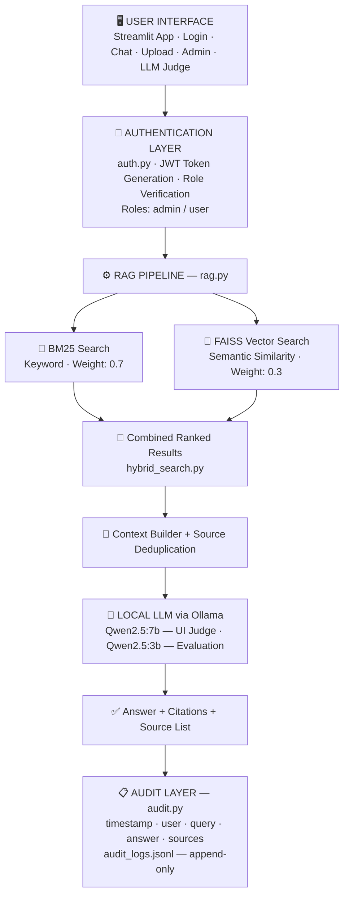

# 🧬 Life Sciences RAG Assistant

A **Retrieval-Augmented Generation (RAG)** system for life sciences
queries using **local open-source models**, ensuring **data privacy,
cost-efficiency, and offline capability**.

------------------------------------------------------------------------

# Why This Approach?
- Life sciences data — drug databases, clinical study records, patient outcome data — is sensitive. Sending it to commercial cloud APIs creates privacy and compliance risks. This system solves that by:
- 	Running LLM inference 100% locally via **Ollama (Qwen2.5 models)**
- 	Using hybrid retrieval (BM25 + FAISS) for both keyword precision and semantic depth
- 	Keeping all embeddings and FAISS indexes on-disk with smart incremental updates
- 	Providing JWT-authenticated access with admin and user roles
- 	Logging every interaction in an append-only audit trail (audit_logs.jsonl)

------------------------------------------------------------------------

# 🚀 Features

-   🔍 Hybrid Search (BM25 + FAISS)
-   🤖 Local LLM: Qwen2.5:3B (Ollama)
-   🧠 Semantic Embeddings (Sentence Transformers)
-   📊 Evaluation Metrics (F1, Faithfulness, Relevance)
-   🔐 Authentication (Admin/User roles)
-   📝 Audit Logging
-   🌐 Streamlit

------------------------------------------------------------------------

# Prerequisites
Complete all steps below before running the application.

2.1 Python Environment
•	Python 3.9 or 3.10 (recommended)
•	pip package manager
•	Virtual environment (venv or conda)

2.2 Ollama — Local LLM Runtime
Ollama runs LLM inference locally. Install from: https://ollama.com
# Pull the models used by the system
ollama pull qwen2.5:7b     # Used by Streamlit UI (LLM-as-judge)
ollama pull qwen2.5:3b     # Used by evaluation pipeline
 
# Start Ollama server (must be running before app launch)
ollama serve
 
# Verify models are available
ollama list
Ollama must be running at http://localhost:11434 before starting the app.

2.3 Sentence Transformer Model (Offline)
Download all-MiniLM-L6-v2 locally. The system runs fully offline (TRANSFORMERS_OFFLINE=1).

# Install Git LFS first (one time)
git lfs install

# Clone the entire model repo inside model folder
git clone https://huggingface.co/sentence-transformers/all-MiniLM-L6-v2

# One-time download (run from any Python environment with internet access)
from sentence_transformers import SentenceTransformer
model = SentenceTransformer("all-MiniLM-L6-v2")
model.save("../model/all-MiniLM-L6-v2")
Place the model at: ../model/all-MiniLM-L6-v2/ relative to the project root.

2.4 FAISS
FAISS (Facebook AI Similarity Search) is not bundled with pip by default:
pip install faiss-cpu        # CPU version (works on all machines)
# OR
pip install faiss-gpu        # GPU version (requires CUDA)

2.5 Data Directory
Place your source data files in ../data/ (relative to project root):
data/
├── drugbank_vocabulary.csv
├── HSRR_Archived_Data.csv
├── post_covid.pdf
├── age_memory.pdf
└── (any other CSV / XLSX / PDF / TXT / JSON files)
Supported formats: CSV, XLSX, XLS, PDF, TXT, JSON

------------------------------------------------------------------------

# Installation
git clone <repo-url>
cd clinicaltrails
 
# Create and activate virtual environment
python -m venv venv
venv\Scripts\activate          # Windows
source venv/bin/activate        # macOS / Linux
 
# Install all dependencies
pip install -r requirements.txt

------------------------------------------------------------------------
# Project Structure

clinicaltrails/
│
├── streamlit_app.py        ← Main UI (Streamlit)
├── rag.py                  ← RAG pipeline (retrieve + generate)
├── hybrid_search.py        ← BM25 + FAISS hybrid search
├── ingestion.py            ← Document loading and chunking
├── embeddings.py           ← FAISS index management
├── evaluation.py           ← Evaluation framework (12 tasks)
├── auth.py                 ← JWT authentication (admin / user)
├── audit.py                ← Interaction logging (append-only)
├── requirements.txt        ← Python dependencies
│
├── embeddings/             ← Auto-created on first run
│   ├── faiss.index         ← FAISS vector index
│   ├── documents.pkl       ← Chunked document store
│   ├── metadata.pkl        ← File modification timestamps
│   └── model_meta.pkl      ← Active model path (change detection)
│
├── evaluation_report.json  ← Evaluation output
├── audit_logs.jsonl        ← Audit trail (append-only)
│
├── ../data/                ← Your data files
└── ../model/
    └── all-MiniLM-L6-v2/  ← Local embedding model (offline)

------------------------------------------------------------------------

# 🏗️ Architecture Diagram

------------------------------------------------------------------------

# 🔄 Workflow

    1. User enters query
    2. Query sent to RAG pipeline
    3. Hybrid search retrieves relevant documents
    4. Context is constructed
    5. Prompt sent to local LLM (Ollama)
    6. Answer generated
    7. Sources appended
    8. Response shown in UI
    9. Interaction logged

------------------------------------------------------------------------

# Hybrid Search Design
The system combines two fundamentally different retrieval methods to maximize recall and precision for life sciences queries:

Method	Strength	Weakness
BM25 (keyword)	Exact term matching — drug IDs, dataset codes, clinical terms	Misses paraphrased or synonym queries
FAISS (semantic)	Understands meaning, handles paraphrases and related concepts	Can miss exact identifiers and rare terms
Hybrid (0.7 + 0.3)	Best of both — high precision AND high recall	Slightly more compute per query

Life sciences data contains specific identifiers (DrugBank IDs, dataset codes) where exact matching is critical — hence the higher BM25 weight of 0.7.

# Vectorless Mode
When documents are uploaded through the UI (custom upload), the system runs BM25-only mode (no FAISS index). This enables instant retrieval without re-embedding — critical for interactive use.

------------------------------------------------------------------------
# Evaluation Framework

## Test Suite
12 curated evaluation tasks covering all major data sources:
Domain	Sample Questions
DrugBank Vocabulary	Synonyms, DrugBank IDs, common names for drug entries
HSRR Dataset	Dataset descriptions, purpose, years, instrument details
Post-COVID HRQoL PDF	Pooled EQ-5D scores, determinants of impaired HRQoL
Age Memory Research PDF	Dopaminergic mechanisms, engram cell reactivation patterns

## Metrics & Scoring
Final Score = 0.30 × BERTScore F1
           + 0.25 × LLM Judge Score
           + 0.20 × Faithfulness
           + 0.15 × Relevance
           + 0.10 × Groundedness

Metric	Method	Weight
BERTScore F1	Semantic overlap between answer and ground truth	30%
LLM Judge Score	Qwen2.5:3b scores correctness + completeness + groundedness	25%
Faithfulness	Cosine similarity: answer embedding vs context embedding	20%
Relevance	Cosine similarity: answer embedding vs question embedding	15%
Groundedness	Sentence-level grounding — % sentences cosine sim > 0.55	10%

Output is saved to evaluation_report.json with per-question breakdowns.

------------------------------------------------------------------------
# Authentication & Security

## Default Credentials
Username	Password	Role
admin	admin123	admin — can reload base RAG index
user	user123	user — query and upload only

⚠️  Change credentials in auth.py and set JWT_SECRET via environment variable before any deployment:
export JWT_SECRET=your_long_random_secret_here

## JWT Token Flow
- User submits credentials → authenticate() validates against USERS dict
- On success: JWT token generated with user, role, exp, iat claims
- Token stored in st.session_state — valid for 1 hour (TOKEN_EXPIRY)
- Every page load: verify_token() decodes and validates the token
- On expiry or invalid token: session cleared, redirected to login

------------------------------------------------------------------------

# Running the System

## Start the App
- Terminal 1: start Ollama
- ollama serve
 
## Terminal 2: start Streamlit
- streamlit run streamlit_app.py
- Open in browser: http://localhost:8501

## Run Evaluation
- python evaluation.py
# Results saved to: evaluation_report.json

------------------------------------------------------------------------
# Module Reference

## streamlit_app.py
Function	Description
login_page()	JWT-based login with spinner UX and two-phase auth flow
chat_section()	Query input, streaming answer display, source citation expander
upload_section()	File uploader — instantly enables BM25-only RAG on custom docs
admin_panel()	Admin-only button to reload base RAG index
llm_judge()	Calls Qwen2.5:7b via Ollama to score faithfulness/relevance/correctness
init_rag_once()	Cached with @st.cache_resource — runs only once per session

## rag.py
Function	Description
init_hybrid(docs, index)	Initializes HybridSearch with documents and optional FAISS index
retrieve(query, top_k=7)	Fetches top documents, deduplicates by source, builds context strings
generate_answer(query, ctx, cit)	Builds strict RAG prompt, calls Ollama, appends citation footer

## embeddings.py
Function	Description
load_or_create_faiss(data_dir)	Smart loader with 4-case change detection (rebuild/incremental/cached)
build_faiss_index(embeddings)	Creates L2-normalized IndexFlatIP for cosine similarity search
is_model_changed()	Compares stored model path vs current — triggers full rebuild if different

## hybrid_search.py
Function	Description
HybridSearch.__init__()	Initializes BM25 with tokenized corpus; stores FAISS index and embed model
bm25_search(query, top_k)	Lowercased + cleaned query → BM25Okapi.get_scores() → top-k docs
vector_search(query, top_k)	Encodes query → FAISS index.search() → top-k docs by cosine sim
search(query, top_k=5)	Combines scores (0.7 BM25 + 0.3 vector), sorts, returns final top-k

## ingestion.py
Function	Description
load_documents(data_dir)	Iterates all supported files, extracts text, chunks, returns doc list + mtime map

## evaluation.py
Function	Description
evaluate()	Runs all 12 eval tasks, computes all metrics, writes evaluation_report.json
compute_bertscore(pred, ref)	BERTScore F1 via bert-score library
compute_faithfulness(ans, ctxs)	Embedding cosine similarity: answer vs top-3 context chunks
compute_relevance(ans, q)	Embedding cosine similarity: normalized answer vs question
compute_groundedness(ans, ctxs)	% of answer sentences with cosine sim > 0.55 against context
llm_judge(q, ans, gt, ctx)	Prompts Qwen2.5:3b to return JSON with correctness, completeness, groundedness

## auth.py
Function	Description
authenticate(username, password)	Validates credentials, generates JWT with user + role + expiry claims
verify_token(token)	Decodes JWT, returns (user, role) or (None, None) on expiry/invalid
check_permission(token, role)	Returns True if token valid and role matches required_role

## audit.py
Function	Description
log_interaction(user, query, answer, sources)	Appends JSON line to audit_logs.jsonl with UTC timestamp

------------------------------------------------------------------------

## Configuration Reference
Parameter	Location	Default	Description
OLLAMA_MODEL	rag.py	qwen2.5:3b	Model for answer generation (env: RAG_MODEL)
OLLAMA_MODEL	streamlit_app.py	qwen2.5:7b	Model for LLM-as-judge scoring
JWT_SECRET	auth.py	env var	JWT signing key — must be set in production
TOKEN_EXPIRY	auth.py	1 hour	JWT session duration
chunk_size	ingestion.py	500	Max characters per document chunk
chunk_overlap	ingestion.py	100	Character overlap between adjacent chunks
top_k (retrieve)	rag.py	7	Documents fetched before deduplication
BM25 weight	hybrid_search.py	0.7	Weight for keyword search component
FAISS weight	hybrid_search.py	0.3	Weight for semantic search component

------------------------------------------------------------------------

## Troubleshooting
Issue	Solution
Ollama connection error	Run: ollama serve. Check model is pulled: ollama list
FAISS index not found	Auto-builds on first run. Ensure ../data/ contains files.
Model path error	Verify ../model/all-MiniLM-L6-v2/ exists relative to project root.
Empty search results	Check terminal for chunk count during ingestion. Ensure data files are non-empty.
JWT expired warning	Sessions last 1 hour. Log out and log back in.
BERTScore import error	Run: pip install bert-score (evaluation only)
bert-score in requirements.txt	Fix the typo — it should be bert-score==0.3.13 (with hyphen)

------------------------------------------------------------------------

## Future Work
•	RAGAS integration for standardized, reproducible evaluation benchmarks
•	Cross-encoder re-ranking (e.g., ms-marco-MiniLM) for improved precision
•	GPU-accelerated FAISS (faiss-gpu) for large-scale document collections
•	Streaming LLM responses in the Streamlit UI
•	Multi-user audit dashboard with filtering and export
•	Support for DICOM and HL7 FHIR medical data formats
•	Configurable chunking strategies (semantic, sentence-level)

------------------------------------------------------------------------

# 🔐 Privacy

-   Fully local inference
-   No external APIs
-   Secure for sensitive data

# 👨‍💻 Author

Raghava Sai\
AI/ML Engineer \| RAG Systems
