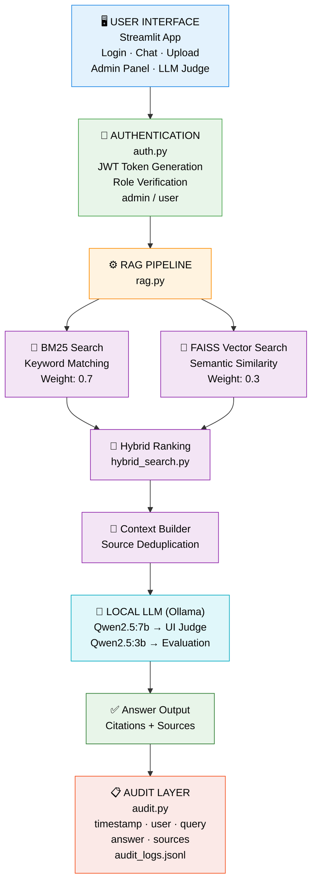
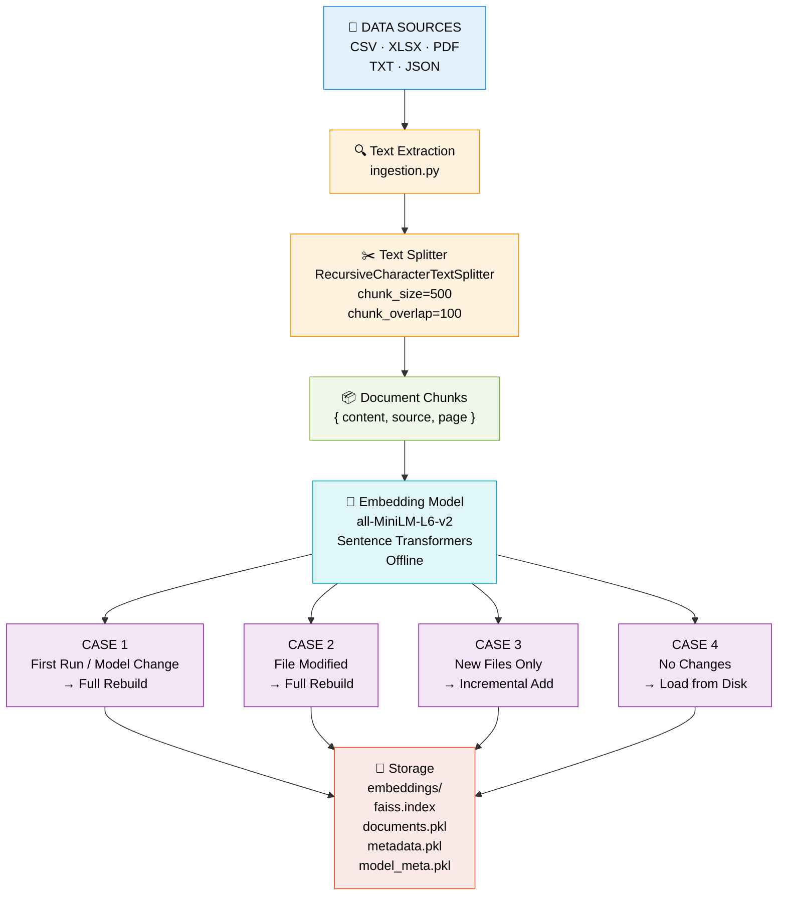

# 🧬 Life Sciences RAG Assistant

A **Retrieval-Augmented Generation (RAG)** system for life sciences
queries using **local open-source models**, ensuring **data privacy,
cost-efficiency, and offline capability**.

------------------------------------------------------------------------

# Why This Approach?
- Life sciences data — drug databases, clinical study records, patient outcome data — is sensitive. Sending it to commercial cloud APIs creates privacy and compliance risks. This system solves that by:
- 	Running LLM inference 100% locally via **Ollama (Qwen2.5 models)**
- 	Using hybrid retrieval (BM25 + FAISS) for both keyword precision and semantic depth
- 	Keeping all embeddings and FAISS indexes on-disk with smart incremental updates
- 	Providing JWT-authenticated access with admin and user roles
- 	Logging every interaction in an append-only audit trail (audit_logs.jsonl)

------------------------------------------------------------------------

# 🚀 Features

-   🔍 Hybrid Search (BM25 + FAISS)
-   🤖 Local LLM: Qwen2.5:3B (Ollama)
-   🧠 Semantic Embeddings (Sentence Transformers)
-   📊 Evaluation Metrics (F1, Faithfulness, Relevance)
-   🔐 Authentication (Admin/User roles)
-   📝 Audit Logging
-   🌐 Streamlit

------------------------------------------------------------------------

# Prerequisites
Complete all steps below before running the application.

2.1 Python Environment
•	Python 3.9 or 3.10 (recommended)
•	pip package manager
•	Virtual environment (venv or conda)

2.2 Ollama — Local LLM Runtime
Ollama runs LLM inference locally. Install from: https://ollama.com
# Pull the models used by the system
- ollama pull qwen2.5:7b     # Used by Streamlit UI (LLM-as-judge)
- ollama pull qwen2.5:3b     # Used by evaluation pipeline
 
# Start Ollama server (must be running before app launch)
- ollama serve
 
# Verify models are available
- ollama list
- Ollama must be running at http://localhost:11434 before starting the app.

2.3 Sentence Transformer Model (Offline)
Download all-MiniLM-L6-v2 locally. The system runs fully offline (TRANSFORMERS_OFFLINE=1).

# Clone the entire model repo inside the model folder
- git clone https://huggingface.co/sentence-transformers/all-MiniLM-L6-v2

# Install Git LFS first (one time)
- git lfs install

# One-time download (run from any Python environment with internet access)
from sentence_transformers import SentenceTransformer
model = SentenceTransformer("all-MiniLM-L6-v2")
model.save("../model/all-MiniLM-L6-v2")
Place the model at: ../model/all-MiniLM-L6-v2/ relative to the project root.

2.4 FAISS
FAISS (Facebook AI Similarity Search) is not bundled with pip by default:
pip install faiss-cpu        # CPU version (works on all machines)
# OR
pip install faiss-gpu        # GPU version (requires CUDA)

2.5 Data Directory
Place your source data files in ../data/ (relative to project root):
```
data/
├── drugbank_vocabulary.csv
├── HSRR_Archived_Data.csv
├── post_covid.pdf
├── age_memory.pdf
└── (any other CSV / XLSX / PDF / TXT / JSON files)
```
Supported formats: CSV, XLSX, XLS, PDF, TXT, JSON

------------------------------------------------------------------------

# Installation
git clone <repo-url>
cd clinicaltrails
 
# Create and activate a virtual environment
python -m venv venv
venv\Scripts\activate          # Windows
source venv/bin/activate        # macOS / Linux
 
# Install all dependencies
pip install -r requirements.txt

------------------------------------------------------------------------
# Project Structure
```
clinicaltrails/
│
├── streamlit_app.py        ← Main UI (Streamlit)
├── rag.py                  ← RAG pipeline (retrieve + generate)
├── hybrid_search.py        ← BM25 + FAISS hybrid search
├── ingestion.py            ← Document loading and chunking
├── embeddings.py           ← FAISS index management
├── evaluation.py           ← Evaluation framework (12 tasks)
├── auth.py                 ← JWT authentication (admin/user)
├── audit.py                ← Interaction logging (append-only)
├── requirements.txt        ← Python dependencies
│
├── embeddings/             ← Auto-created on first run
│   ├── faiss.index         ← FAISS vector index
│   ├── documents.pkl       ← Chunked document store
│   ├── metadata.pkl        ← File modification timestamps
│   └── model_meta.pkl      ← Active model path (change detection)
│
├── evaluation_report.json  ← Evaluation output
├── audit_logs.jsonl        ← Audit trail (append-only)
│
├── ../data/                ← Your data files
└── ../model/
    └── all-MiniLM-L6-v2/  ← Local embedding model (offline)
```
------------------------------------------------------------------------

# 🏗️ Architecture Diagram

# End -to-End Workflow

```mermaid
flowchart TD
    %% Nodes
    UI["🖥️ USER INTERFACE<br>Streamlit App<br>Login · Chat · Upload<br>Admin Panel · LLM Judge"]

    AUTH["🔐 AUTHENTICATION<br>auth.py<br>JWT Token Generation<br>Role Verification<br>admin / user"]

    RAG["⚙️ RAG PIPELINE<br>rag.py"]

    BM25["📝 BM25 Search<br>Keyword Matching<br>Weight: 0.7"]

    FAISS["🔢 FAISS Vector Search<br>Semantic Similarity<br>Weight: 0.3"]

    HYBRID["🔀 Hybrid Ranking<br>hybrid_search.py"]

    CTX["📄 Context Builder<br>Source Deduplication"]

    LLM["🤖 LOCAL LLM (Ollama)<br>Qwen2.5:7b → UI Judge<br>Qwen2.5:3b → Evaluation"]

    ANS["✅ Answer Output<br>Citations + Sources"]

    AUDIT["📋 AUDIT LAYER<br>audit.py<br>timestamp · user · query<br>answer · sources<br>audit_logs.jsonl"]
    UI --> AUTH --> RAG
    RAG --> BM25
    RAG --> FAISS
    BM25 --> HYBRID
    FAISS --> HYBRID
    HYBRID --> CTX --> LLM --> ANS --> AUDIT

    %% Color Classes
    classDef ui fill:#E3F2FD,stroke:#1E88E5,stroke-width:1px,color:#000;
    classDef auth fill:#E8F5E9,stroke:#43A047,stroke-width:1px,color:#000;
    classDef rag fill:#FFF3E0,stroke:#FB8C00,stroke-width:1px,color:#000;
    classDef retrieval fill:#F3E5F5,stroke:#8E24AA,stroke-width:1px,color:#000;
    classDef llm fill:#E0F7FA,stroke:#00ACC1,stroke-width:1px,color:#000;
    classDef output fill:#E8F5E9,stroke:#2E7D32,stroke-width:1px,color:#000;
    classDef audit fill:#FBE9E7,stroke:#F4511E,stroke-width:1px,color:#000;

    %% Apply Classes
    class UI ui;
    class AUTH auth;
    class RAG rag;
    class BM25,FAISS,HYBRID,CTX retrieval;
    class LLM llm;
    class ANS output;
    class AUDIT audit;
```
# Data Ingestion & Embedding Pipeline

```mermaid
flowchart TD

    %% Nodes
    SRC["📂 DATA SOURCES<br>CSV · XLSX · PDF<br>TXT · JSON"]

    EXTRACT["🔍 Text Extraction<br>ingestion.py"]

    SPLIT["✂️ Text Splitter<br>RecursiveCharacterTextSplitter<br>chunk_size=500<br>chunk_overlap=100"]

    CHUNKS["📦 Document Chunks<br>{ content, source, page }"]

    MODEL["🧠 Embedding Model<br>all-MiniLM-L6-v2<br>Sentence Transformers<br>Offline"]

    C1["CASE 1<br>First Run / Model Change<br>→ Full Rebuild"]

    C2["CASE 2<br>File Modified<br>→ Full Rebuild"]

    C3["CASE 3<br>New Files Only<br>→ Incremental Add"]

    C4["CASE 4<br>No Changes<br>→ Load from Disk"]

    STORE["💾 Storage<br>embeddings/<br>faiss.index<br>documents.pkl<br>metadata.pkl<br>model_meta.pkl"]
    SRC --> EXTRACT --> SPLIT --> CHUNKS --> MODEL
    MODEL --> C1
    MODEL --> C2
    MODEL --> C3
    MODEL --> C4
    C1 --> STORE
    C2 --> STORE
    C3 --> STORE
    C4 --> STORE

    %% Color Classes
    classDef source fill:#E3F2FD,stroke:#1E88E5,stroke-width:1px,color:#000;
    classDef process fill:#FFF3E0,stroke:#FB8C00,stroke-width:1px,color:#000;
    classDef chunk fill:#F1F8E9,stroke:#7CB342,stroke-width:1px,color:#000;
    classDef model fill:#E0F7FA,stroke:#00ACC1,stroke-width:1px,color:#000;
    classDef logic fill:#F3E5F5,stroke:#8E24AA,stroke-width:1px,color:#000;
    classDef storage fill:#FBE9E7,stroke:#F4511E,stroke-width:1px,color:#000;

    %% Apply Classes
    class SRC source;
    class EXTRACT,SPLIT process;
    class CHUNKS chunk;
    class MODEL model;
    class C1,C2,C3,C4 logic;
    class STORE storage;
```
------------------------------------------------------------------------

# 🔄 Workflow

    1. User enters query
    2. Query sent to RAG pipeline
    3. Hybrid search retrieves relevant documents
    4. Context is constructed
    5. Prompt sent to local LLM (Ollama)
    6. Answer generated
    7. Sources appended
    8. Response shown in UI
    9. Interaction logged

------------------------------------------------------------------------

# Hybrid Search Design
The system combines two fundamentally different retrieval methods to maximize recall and precision for life sciences queries:

- Method Strength & Weakness
 1. BM25 (keyword)	Exact term matching — drug IDs, dataset codes, clinical terms. Misses paraphrased or synonym queries
 2. FAISS (semantic)	understands meaning, handles paraphrases, and related concepts. It can miss exact identifiers and rare terms
 3. Hybrid (0.7 + 0.3)	Best of both — high precision AND high recall	Slightly more compute per query

Life sciences data contains specific identifiers (DrugBank IDs, dataset codes) where exact matching is critical — hence the higher BM25 weight of 0.7.

# Vectorless Mode
When documents are uploaded through the UI (custom upload), the system runs BM25-only mode (no FAISS index). This enables instant retrieval without re-embedding — critical for interactive use.

------------------------------------------------------------------------
# Evaluation Framework

## Test Suite
```

12 curated evaluation tasks covering all major data sources:

| Domain                   | Sample Questions |
|--------------------------|------------------|
| DrugBank Vocabulary      | Synonyms, DrugBank IDs, and common names for drug entries |
| HSRR Dataset             | Dataset descriptions, purpose, years, instrument details |
| Post-COVID HRQoL PDF     | Pooled EQ-5D scores, determinants of impaired HRQoL |
| Age Memory Research PDF  | Dopaminergic mechanisms, engram cell reactivation patterns |

```

## Metrics & Scoring
**Final Score Calculation**
Final Score = 0.30 × BERTScore F1
           + 0.25 × LLM Judge Score
           + 0.20 × Faithfulness
           + 0.15 × Relevance
           + 0.10 × Groundedness

### 📈 Metric Breakdown
```
| Metric           | Method                                                                | Weight |
|------------------|-----------------------------------------------------------------------|--------|
| **BERTScore F1** | Semantic overlap between answer and ground truth                      | 30%    |
| **LLM Judge**    | Qwen2.5:3b evaluates correctness, completeness, groundedness          | 25%    |
| **Faithfulness** | Cosine similarity: answer embedding vs context embedding              | 20%    |
| **Relevance**    | Cosine similarity: answer embedding vs question embedding             | 15%    |
| **Groundedness** | Sentence-level grounding (% sentences with cosine sim > 0.55)         | 10%    |
```
Output is saved to evaluation_report.json with per-question breakdowns.

------------------------------------------------------------------------
# Authentication & Security

## Default Credentials
```

| Username | Password | Role |
|----------|----------|------|
| admin    | admin123 | Admin — can reload base RAG index |
| user     | user123  | User — can query and upload data only |


## ⚠️ Security Notice

⚠️ **Important:** Change default credentials before deployment.

- Update credentials in `auth.py`
- Set a secure JWT secret using environment variables

### 🔑 Set JWT Secret

```bash
export JWT_SECRET=your_long_random_secret_here

```
## JWT Token Flow
- User submits credentials → authenticate() validates against USERS dict
- On success: JWT token generated with user, role, exp, iat claims
- Token stored in st.session_state — valid for 1 hour (TOKEN_EXPIRY)
- Every page load: verify_token() decodes and validates the token
- On expiry or invalid token: session cleared, redirected to login

------------------------------------------------------------------------

# Running the System

## Start the App
- Terminal 1: start Ollama
- ollama serve
 
## Terminal 2: start Streamlit
- streamlit run streamlit_app.py
- Open in browser: http://localhost:8501

## Run Evaluation
- python evaluation.py
# Results saved to: evaluation_report.json

------------------------------------------------------------------------
# Module Reference


### 🖥️ streamlit_app.py
```
| Function          | Description |
|------------------|-------------|
| `login_page()`   | JWT-based login with spinner UX and two-phase authentication flow |
| `chat_section()` | Handles query input, streaming responses, and source citation display |
| `upload_section()` | File uploader enabling BM25-only RAG on custom documents |
| `admin_panel()`  | Admin-only interface to reload base RAG index |
| `llm_judge()`    | Calls Qwen2.5:7b via Ollama to score faithfulness, relevance, and correctness |
| `init_rag_once()`| Cached using `@st.cache_resource` — initializes RAG once per session |

---

### ⚙️ rag.py

| Function | Description |
|----------|-------------|
| `init_hybrid(docs, index)` | Initializes HybridSearch with documents and optional FAISS index |
| `retrieve(query, top_k=7)` | Retrieves top documents, deduplicates by source, builds context |
| `generate_answer(query, ctx, cit)` | Builds strict RAG prompt, calls Ollama, appends citations |

---

### 🧠 embeddings.py

| Function | Description |
|----------|-------------|
| `load_or_create_faiss(data_dir)` | Smart loader with 4-case logic (rebuild / incremental / cached) |
| `build_faiss_index(embeddings)` | Creates normalized `IndexFlatIP` for cosine similarity |
| `is_model_changed()` | Detects embedding model changes → triggers full rebuild |

---

### 🔀 hybrid_search.py

| Function | Description |
|----------|-------------|
| `HybridSearch.__init__()` | Initializes BM25 corpus + FAISS index + embedding model |
| `bm25_search(query, top_k)` | Cleans query → BM25 scoring → top-k selection |
| `vector_search(query, top_k)` | Encodes query → FAISS search → top-k results |
| `search(query, top_k=5)` | Combines results (0.7 BM25 + 0.3 vector), returns ranked output |

---

### 📂 ingestion.py

| Function | Description |
|----------|-------------|
| `load_documents(data_dir)` | Loads files, extracts text, chunks documents, returns metadata |

---

### 📊 evaluation.py

| Function | Description |
|----------|-------------|
| `evaluate()` | Runs evaluation suite, computes metrics, writes `evaluation_report.json` |
| `compute_bertscore(pred, ref)` | Computes BERTScore F1 |
| `compute_faithfulness(ans, ctxs)` | Cosine similarity: answer vs top-3 context chunks |
| `compute_relevance(ans, q)` | Cosine similarity: answer vs query |
| `compute_groundedness(ans, ctxs)` | % of sentences grounded in context (> 0.55 similarity) |
| `llm_judge(q, ans, gt, ctx)` | Uses Qwen2.5:3b to score correctness, completeness, groundedness |

---

### 🔐 auth.py

| Function | Description |
|----------|-------------|
| `authenticate(username, password)` | Validates user, generates JWT with role + expiry |
| `verify_token(token)` | Decodes token, returns user and role |
| `check_permission(token, role)` | Ensures user has required role |

---

### 📋 audit.py

| Function | Description |
|----------|-------------|
| `log_interaction(user, query, answer, sources)` | Logs interaction to `audit_logs.jsonl` with timestamp |

---

## ⚙️ Configuration Reference

| Parameter | Location | Default | Description |
|----------|---------|---------|-------------|
| `OLLAMA_MODEL` | rag.py | qwen2.5:3b | Model used for answer generation |
| `OLLAMA_MODEL` | streamlit_app.py | qwen2.5:7b | Model used for LLM-based evaluation |
| `JWT_SECRET` | auth.py | env var | JWT signing key (must be set in production) |
| `TOKEN_EXPIRY` | auth.py | 1 hour | Session duration |
| `chunk_size` | ingestion.py | 500 | Max characters per chunk |
| `chunk_overlap` | ingestion.py | 100 | Overlap between chunks |
| `top_k` | rag.py | 7 | Documents retrieved before deduplication |
| `BM25 weight` | hybrid_search.py | 0.7 | Keyword search weight |
| `FAISS weight` | hybrid_search.py | 0.3 | Semantic search weight |

---

## 🛠️ Troubleshooting

| Issue | Solution |
|------|----------|
| Ollama connection error | Run `ollama serve` and verify models with `ollama list` |
| FAISS index not found | Automatically builds on first run — ensure `../data/` has files |
| Model path error | Verify `../model/all-MiniLM-L6-v2/` exists |
| Empty search results | Ensure data is non-empty and ingestion logs show chunks |
| JWT expired | Sessions last 1 hour — re-login required |
| BERTScore import error | Install with `pip install bert-score` |
| bert-score installation issue | Ensure correct format: `bert-score==0.3.13` |
```

------------------------------------------------------------------------

## Future Work
•	RAGAS integration for standardized, reproducible evaluation benchmarks
•	Cross-encoder re-ranking (e.g., ms-marco-MiniLM) for improved precision
•	GPU-accelerated FAISS (faiss-gpu) for large-scale document collections
•	Streaming LLM responses in the Streamlit UI
•	Multi-user audit dashboard with filtering and export
•	Support for DICOM and HL7 FHIR medical data formats
•	Configurable chunking strategies (semantic, sentence-level)

------------------------------------------------------------------------

# 🔐 Privacy

-   Fully local inference
-   No external APIs
-   Secure for sensitive data

# 👨‍💻 Author

Raghava Sai\
AI/ML Engineer \| RAG Systems
